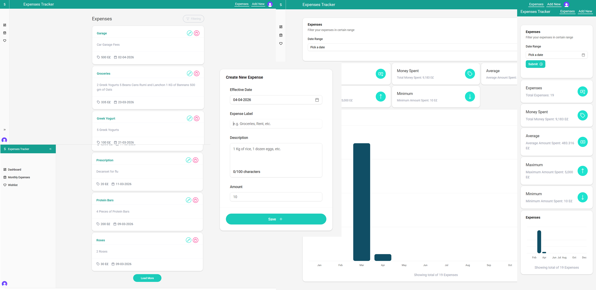

# Expenses Tracker APP

### Technologies Used

```
- React JS using Vite for dynamic UI
- React Router DOM for Navigation
- Typescript for Type Safety
- Shadcn for UI Components
- Tailwind CSS for Styling
- Supabase for Backend
- Clerk For Authentication
```

### Screens


